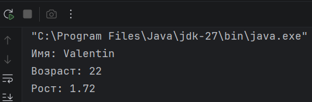

# Домашнее задание N1 (c 13.09.26 до 20.09.26)

---


**Предварительно, перед началом выволнения основного домашнего задания, вам необходимо установить среду разработки, в которой мы работаем. Можно попробовать установить все самостоятельно, но лучше попросить родителей. Также, на любом этапе установки и настройки, если возникают проблемы, можно обратиться к преподавателю.**

[>>> Гайд по установке <<<](../Guide/Software_Installation_Guide.md) **← Сюда можно нажать, чтобы перейти на сайт**

---

## Легенда

В домашних заданиях будут использоваться некоторые обозначения:

- **⁉️ Памятка.** В разделах с пометкой "Памятка" будут описаны теоретическая и практическая информация, пройденная на занятиях и необходимая для выполнения домашнего задания
- **✅ Задание.** Раздел, отмеченный, как "Задание", описывается основное домашнее задание, которое необходимо выполнить
- **📚 Что-то новое.** Здесь будет дополнительная информация, которая может быть полезна, или которую мы еще не прошли
- **💡 Подсказка**. В таких разделах будет подмечено, что еще можно добавить в программу или как решить правильно решать задание
- **🏁 Пример.** В таком разделе будет пример выполнения основного задания, а также результат вывода в консоль


---

## Тема ДЗ: Переменные и вывод в консоль

---

## ⁉️ Как создаются переменные в Java

Как мы определились на занятии, **переменная** - это как шалкер-бокс из Minecraft, у которого есть название, и в который
можно положить какое-то значение. Также мы определились, что если мы хотим что-то хранить в шалкере, то нам нужно
заранее сказать, что именно, например алмазы.

Чтобы создать переменную в Java, нужно написать три вещи по порядку:

```
тип   имя   =   значение;
```

Например:

```java
int age = 12;
```

Здесь:

- `int` — **тип** переменной (какие значения в неё можно класть)
- `age` — **имя** переменной (как мы её будем называть)
- `12` — **значение**, которое мы положили в коробочку
- `;` — точка с запятой в конце, она обязательна, это как точка в конце предложения в руссом языке

---

## ⁉️ Основные типы переменных

| Тип       | Что хранит                                                           | Пример значения          |
|-----------|----------------------------------------------------------------------|--------------------------|
| `int`     | Целые числа (без точки)                                              | `10`, `-5`, `2024`       |
| `float`   | Дробные числа (с точкой). В конце числа пишем `f`                    | `1.72f`, `3.5f`          |
| `char`    | Один-единственный символ. Пишется в **одинарных** кавычках           | `'a'`, `'Я'`, `'5'`      |
| `String`  | Строка — любой текст, много символов. Пишется в **двойных** кавычках | `"Привет"`, `"Valentin"` |
| `boolean` | Логическое значение: правда или ложь                                 | `true` или `false`       |

**Важно запомнить:**

- `char` - всегда **один** символ и одинарные кавычки `' '`
- `String` - это **слово или фраза**, и кавычки двойные `" "`
- `float` без `f` на конце Java не поймёт - обязательно ставим `f`
- `boolean` может быть только `true` или `false`, никаких других слов

---

## ⁉️ Вывод в консоль

Для вывода значений переменных и других данных в Java используется команда:

```java
System.out.println(имя_переменной);
```

Она печатает значение переменной на экран и переходит на новую строку.

---

## ✅ Основное задание

1. Открой свою среду разработки Java (например, IntelliJ IDEA).
2. Внутри функции `main` создай все пять переменных:
    1. Переменную типа `int` с именем **age** - она будет хранить возраст, целое число.
    2. Переменную типа `float` с именем **height** - она будет хранить рост, дробное число (не забудь букву `f` в конце
       значения!).
    3. Переменную типа `char` с именем **school** - она будет хранить один символ, например букву класса.
    4. Переменную типа `String` с именем **name** - она будет хранить имя, текст в двойных кавычках.
    5. Переменную типа `boolean` с именем **isTeacher** - она будет хранить `true` или `false`: является ли человек
       учителем.
3. Выведи в консоль **любые три** из этих переменных с помощью `System.out.println(...)`.
4. Запусти программу и проверь, что в консоли появились правильные значения.
5. Программу и результат в консоли нужно сфотографировать и показать преподавателю (можно попросить родителей) или принести фото с собой, если у вас есть собственный телефон

---

📚 **Что-то новое**

```text
Функция `main` - это то место в программе, откуда всё начинается: именно с неё Java начинает выполнять код. Внутри неё,
между фигурными скобками `{ }`, мы и пишем весь наш код - в том числе создаём переменные.
```

---

💡 **Подсказка:** попробуй вывести не просто значение, а с подписью, например:

```java
System.out.println("Меня зовут: "+name);
```

---

## 🏁 Пример

```java
public class Main {
    public static void main(String[] args) {
        int age = 22;
        float height = 1.72f;
        char school = 'b';
        String name = "Valentin";
        boolean isTeacher = true;

        System.out.println("Имя: " + name);
        System.out.println("Возраст: " + age);
        System.out.println("Рост: " + height);
    }
}
```


