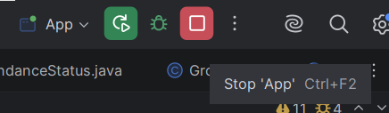

# Домашнее задание N4 (с 04.10.26 до 11.10.26)

---

## Легенда

В домашних заданиях будут использоваться некоторые обозначения:

- **⁉️ Памятка.** В разделах с пометкой "Памятка" будут описаны теоретическая и практическая информация, пройденная на занятиях и необходимая для выполнения домашнего задания
- **✅ Задание.** Раздел, отмеченный, как "Задание", описывается основное домашнее задание, которое необходимо выполнить
- **📚 Что-то новое.** Здесь будет дополнительная информация, которая может быть полезна, или которую мы еще не прошли
- **💡 Подсказка**. В таких разделах будет подмечено, что еще можно добавить в программу или как решить правильно решать задание
- **🏁 Пример.** В таком разделе будет пример выполнения основного задания, а также результат вывода в консоль

---


**На следующем занятии 08.10.26 мы проведем контрольную работу в тестовом формате.** Тест будет состоять из 4 тем, пройденных на занятиях, в каждой теме 3 вопроса разной сложности: _легкий, средний, сложный_.

**Список тем:**

- [**Переменные и вывод в консоль**](./HW1.md#тема-дз-переменные-и-вывод-в-консоль)
- [**Ввод данных, арифметические и побитовые операции**](./HW2.md#тема-дз-ввод-данных-арифметические-и-побитовые-операции)
- [**Логические выражения, условный оператор, switch/case**](./HW3.md#тема-дз-логические-выражения-условный-оператор-switchcase)
- [**Тернарная операция, циклы while/do-while/for, break, continue**](./HW4.md#тема-дз-тернарная-операция-циклы-whiledo-whilefor-break-continue)

---

## Тема ДЗ: Тернарная операция, циклы while/do-while/for, break, continue

---

## ⁉️ Тернарная операция

Тернарная операция - короткая запись простого `if / else` в одну строку:

```
условие ? значение_если_true : значение_если_false
```

```java
int health = 15;
String status = health > 0 ? "Жив" : "Погиб";
System.out.println(status);
```

---

## ⁉️ Циклы while и do-while

Цикл повторяет код, пока выполняется условие.

`while` проверяет условие **перед** каждым повторением:

```java
int count = 0;
while (count < 5) {
    System.out.println("Повтор номер: " + count);
    count++;
}
```

`do-while` сначала выполняет код, а условие проверяет **после** - поэтому код выполнится хотя бы один раз:

```java
int count = 0;
do {
    System.out.println("Повтор номер: " + count);
    count++;
} while (count < 5);
```

---

## ⁉️ Цикл for

Удобен, когда заранее известно, сколько раз нужно повторить действие:

```java
for (int i = 0; i < 5; i++) {
    System.out.println("Повтор номер: " + i);
}
```

Три части в скобках: старт (`int i = 0`), условие (`i < 5`), шаг (`i++`).

---

## ⁉️ Операторы break и continue

- `break` - досрочно прерывает выполнение всего цикла
- `continue` - пропускает оставшуюся часть текущего повторения и переходит к следующему, не прерывая весь цикл

```java
for (int i = 1; i <= 10; i++) {
    if (i == 7) {
        break; // полностью остановит цикл на седьмом повторении
    }
    if (i % 2 == 0) {
        continue; // пропустит это повторение и перейдёт к следующему
    }
    System.out.println(i);
}
```

---

## ✅ Основное задание

### Часть 1. Обратный отсчёт

Напиши программу с циклом `while`, которая:
1. Выводит в консоль обратный отсчёт от 10 до 1 (каждое число на новой строке)
2. После окончания отсчёта выводит `"Старт!"`

### Часть 2. Бой персонажа

Напиши программу «Бой персонажа», которая использует цикл `for`, `break`, `continue` и тернарную операцию вместе:

1. Заведи переменную `int health = 100;` - здоровье персонажа
2. С помощью цикла `for` сделай 10 раундов боя (переменная `round` от 1 до 10)
3. На **четвёртом** раунде персонаж уворачивается и не получает урона - с помощью `continue` пропусти в этом раунде
   уменьшение здоровья и переход к следующему раунду (но раунд всё равно должен засчитаться)
4. В остальных раундах уменьшай `health` на `15` (`health -= 15;`)
5. С помощью **тернарной операции** определи статус персонажа: `"Жив"`, если `health > 0`, иначе `"Погиб"`
6. Выведи в консоль номер раунда, текущее здоровье и статус, например: `Раунд 3: здоровье = 55, статус: Жив`
7. Если здоровье стало `0` или меньше - с помощью `break` останови бой досрочно, дальше раунды не нужны
8. Запусти программу и проверь результат в консоли - бой должен закончиться раньше, чем на 10 раунде

Программу и результат в консоли нужно сфотографировать и показать преподавателю (можно попросить родителей) или
принести фото с собой, если у вас есть собственный телефон

---

📚 **Что-то новое**

```text
Если в программе есть два вложенных друг в друга цикла, обычный break прервёт только внутренний цикл, а внешний
продолжит работать. Чтобы прервать сразу оба цикла, внешнему циклу можно дать "метку" (имя) и написать
break меткаЦикла;  - например, break outer;.
```

```java
outer:
for (int i = 0; i < 10; i++) {
    for (int j = 0; j < 10; j++) {
        if (i + j == 5) {
            System.out.println(i + " + " + j + " = " + (i+j));
            break outer;
        }
    }
}
```

---

💡 **Подсказка:** если программа "зависла" и ничего не происходит в консоли - скорее всего, получился бесконечный
цикл (забыли изменить переменную-счётчик или условие никогда не станет false). Останови программу красной кнопкой
Stop в IntelliJ IDEA, проверь условие цикла и запусти заново.



---

## 🏁 Пример

```java
public class Main {
    public static void main(String[] args) {
        // Часть 1. Обратный отсчёт
        int count = 10;
        while (count >= 1) {
            System.out.println(count);
            count--;
        }
        System.out.println("Старт!");

        // Часть 2. Бой персонажа
        int health = 100;

        for (int round = 1; round <= 10; round++) {
            if (round == 4) {
                System.out.println("Раунд " + round + ": персонаж уворачивается!");
                continue;
            }

            health -= 15;
            String status = health > 0 ? "Жив" : "Погиб";
            System.out.println("Раунд " + round + ": здоровье = " + health + ", статус: " + status);

            if (health <= 0) {
                break;
            }
        }
    }
}
```

**Пример вывода в консоль:**

```text
10
9
8
7
6
5
4
3
2
1
Старт!
Раунд 1: здоровье = 85, статус: Жив
Раунд 2: здоровье = 70, статус: Жив
Раунд 3: здоровье = 55, статус: Жив
Раунд 4: персонаж уворачивается!
Раунд 5: здоровье = 40, статус: Жив
Раунд 6: здоровье = 25, статус: Жив
Раунд 7: здоровье = 10, статус: Жив
Раунд 8: здоровье = -5, статус: Погиб
```
